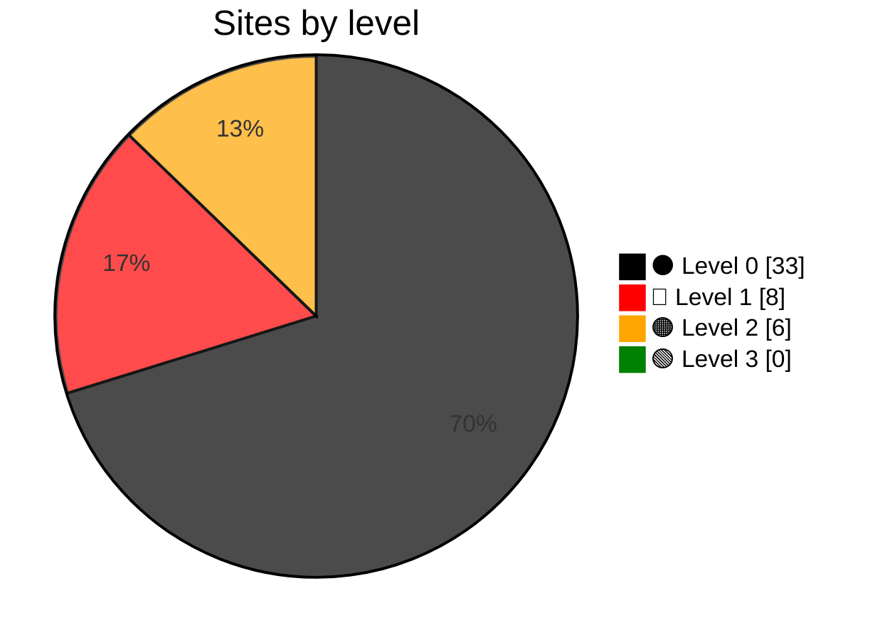

# Grading Government Websites (`glwa`)

  

`glwa` audits Sri Lankan government websites using an evidence-based, cumulative grading model. It records reproducible evidence for each level and publishes the latest classification and audit report for every website in Sri Lanka. 🇱🇰

> **Implementation status:** Only `⚫ Level 0`, `🔴 Level 1`, `🟠 Level 2`, and `🟢 Level 3` are implemented.

## Levels and scoring

| Level        | Implemented | Description                                                                                                                                                  |
| ------------ | :---------: | ------------------------------------------------------------------------------------------------------------------------------------------------------------ |
| `⚫ Level 0` |   ✅ Yes    | A site is classified as `⚫ Level 0` when it is unavailable or unusable, or when there is not enough evidence to establish that it meets `🔴 Level 1`.       |
| `🔴 Level 1` |   ✅ Yes    | The website must be available, usable, and clearly associated with the government institution. It must load reliably with valid DNS, HTTP, and TLS behavior. |
| `🟠 Level 2` |   ✅ Yes    | Citizens must be able to identify and contact the correct office for the service they need.                                                                  |
| `🟢 Level 3` |   ✅ Yes    | Citizens must find complete and current instructions, requirements, fees, times, and usable forms.                                                           |
| `🔵 Level 4` |    ❌ No    | Citizens must be able to complete, pay for, track, and receive the outcome of a service online.                                                              |
| `🟣 Level 5` |    ❌ No    | Services must be connected across agencies, proactive for eligible citizens, explainable, and accountable.                                                   |

The score is out of 3. `🔴 Level 1` through `🟢 Level 3` each contribute up to 1 point, calculated as passing checks divided by total checks. `⚫ Level 0` contributes no points. The total is shown to one decimal place.

## Sites by level

## Documentation

- [Article](docs/article.md): The grading framework.
- [Design](docs/design.md): Architecture and rules.
- [Roadmap](docs/roadmap.md): Work completed and planned.

## `⚫ Level 0`

**33 URLs at `⚫ Level 0`.**

Checks used: Availability and usability checks.

| Score | URL                                                                                                       |
| ----: | --------------------------------------------------------------------------------------------------------- |
| 0.0/3 | [https://www.cultural.gov.lk/](latest_audit_reports/www.cultural.gov.lk/audit.md)                         |
| 0.0/3 | [https://www.justiceministry.gov.lk/](latest_audit_reports/www.justiceministry.gov.lk/audit.md)           |
| 0.0/3 | [https://www.mhc.gov.lk/](latest_audit_reports/www.mhc.gov.lk/audit.md)                                   |
| 0.0/3 | [https://www.minparliament.gov.lk/](latest_audit_reports/www.minparliament.gov.lk/audit.md)               |
| 0.0/3 | [https://www.mohsl.gov.lk/](latest_audit_reports/www.mohsl.gov.lk/audit.md)                               |
| 0.0/3 | [https://www.nipunatha.gov.lk/](latest_audit_reports/www.nipunatha.gov.lk/audit.md)                       |
| 0.0/3 | [https://www.petroleummin.gov.lk/](latest_audit_reports/www.petroleummin.gov.lk/audit.md)                 |
| 0.0/3 | [https://www.plantationindustries.gov.lk/](latest_audit_reports/www.plantationindustries.gov.lk/audit.md) |
| 0.0/3 | [https://www.slmts.slt.lk/](latest_audit_reports/www.slmts.slt.lk/audit.md)                               |
| 0.0/3 | [https://www.sportsmin.gov.lk/](latest_audit_reports/www.sportsmin.gov.lk/audit.md)                       |
| 0.0/3 | [https://www.telepost.gov.lk/](latest_audit_reports/www.telepost.gov.lk/audit.md)                         |
| 0.0/3 | [https://www.tisedmin.gov.lk/](latest_audit_reports/www.tisedmin.gov.lk/audit.md)                         |
| 0.0/3 | [https://www.urbanlanka.lk/](latest_audit_reports/www.urbanlanka.lk/audit.md)                             |
| 0.1/3 | [https://www.edip.gov.lk/](latest_audit_reports/www.edip.gov.lk/audit.md)                                 |
| 0.1/3 | [https://www.indigenousmedimini.gov.lk/](latest_audit_reports/www.indigenousmedimini.gov.lk/audit.md)     |
| 0.1/3 | [https://www.mnbd.gov.lk/](latest_audit_reports/www.mnbd.gov.lk/audit.md)                                 |
| 0.1/3 | [https://www.mpi.gov.lk/](latest_audit_reports/www.mpi.gov.lk/audit.md)                                   |
| 0.1/3 | [https://www.mrdev.gov.lk/](latest_audit_reports/www.mrdev.gov.lk/audit.md)                               |
| 0.1/3 | [https://www.mwsd.gov.lk/](latest_audit_reports/www.mwsd.gov.lk/audit.md)                                 |
| 0.1/3 | [https://www.pclg.gov.lk/](latest_audit_reports/www.pclg.gov.lk/audit.md)                                 |
| 0.1/3 | [https://www.powermin.gov.lk/](latest_audit_reports/www.powermin.gov.lk/audit.md)                         |
| 0.1/3 | [https://www.religiousaffairs.gov.lk/](latest_audit_reports/www.religiousaffairs.gov.lk/audit.md)         |
| 0.1/3 | [https://www.resettlementmin.gov.lk/](latest_audit_reports/www.resettlementmin.gov.lk/audit.md)           |
| 0.6/3 | [https://www.sredmin.gov.lk/](latest_audit_reports/www.sredmin.gov.lk/audit.md)                           |
| 0.7/3 | [https://www.disastermin.gov.lk/](latest_audit_reports/www.disastermin.gov.lk/audit.md)                   |
| 0.7/3 | [https://www.houseconmin.gov.lk/](latest_audit_reports/www.houseconmin.gov.lk/audit.md)                   |
| 0.7/3 | [https://www.irrigationmin.gov.lk/](latest_audit_reports/www.irrigationmin.gov.lk/audit.md)               |
| 0.7/3 | [https://www.livestock.gov.lk/](latest_audit_reports/www.livestock.gov.lk/audit.md)                       |
| 0.7/3 | [https://www.motr.gov.lk/](latest_audit_reports/www.motr.gov.lk/audit.md)                                 |
| 0.7/3 | [https://www.socialwelfare.gov.lk/](latest_audit_reports/www.socialwelfare.gov.lk/audit.md)               |
| 0.7/3 | [https://www.youthskillsmin.gov.lk/](latest_audit_reports/www.youthskillsmin.gov.lk/audit.md)             |
| 0.9/3 | [https://www.health.gov.lk/](latest_audit_reports/www.health.gov.lk/audit.md)                             |
| 0.9/3 | [https://www.labourmin.gov.lk/](latest_audit_reports/www.labourmin.gov.lk/audit.md)                       |

## `🔴 Level 1`

**8 URLs at `🔴 Level 1`.**

Checks used: DNS resolves, Domain not parked, Site not defaced, Content relevant, Hosting configured, HTTP available, Redirect related, TLS browser trusted, TLS not expired, TLS hostname matches.

| Score | URL                                                                                 |
| ----: | ----------------------------------------------------------------------------------- |
| 1.0/3 | [https://www.industry.gov.lk/](latest_audit_reports/www.industry.gov.lk/audit.md)   |
| 1.0/3 | [https://www.landmin.gov.lk/](latest_audit_reports/www.landmin.gov.lk/audit.md)     |
| 1.0/3 | [https://www.moe.gov.lk/](latest_audit_reports/www.moe.gov.lk/audit.md)             |
| 1.0/3 | [https://www.pubad.gov.lk/](latest_audit_reports/www.pubad.gov.lk/audit.md)         |
| 1.0/3 | [https://www.transport.gov.lk/](latest_audit_reports/www.transport.gov.lk/audit.md) |
| 1.7/3 | [https://www.defence.lk/](latest_audit_reports/www.defence.lk/audit.md)             |
| 1.7/3 | [https://www.mfa.gov.lk/](latest_audit_reports/www.mfa.gov.lk/audit.md)             |
| 1.7/3 | [https://www.trade.gov.lk/](latest_audit_reports/www.trade.gov.lk/audit.md)         |

## `🟠 Level 2`

**6 URLs at `🟠 Level 2`.**

Checks used: Postal address, Reachable contacts, Named responsibility.

| Score | URL                                                                                         |
| ----: | ------------------------------------------------------------------------------------------- |
| 2.0/3 | [https://www.fisheries.gov.lk/](latest_audit_reports/www.fisheries.gov.lk/audit.md)         |
| 2.3/3 | [https://www.childwomenmin.gov.lk/](latest_audit_reports/www.childwomenmin.gov.lk/audit.md) |
| 2.3/3 | [https://www.media.gov.lk/](latest_audit_reports/www.media.gov.lk/audit.md)                 |
| 2.3/3 | [https://www.mohe.gov.lk/](latest_audit_reports/www.mohe.gov.lk/audit.md)                   |
| 2.3/3 | [https://www.treasury.gov.lk/](latest_audit_reports/www.treasury.gov.lk/audit.md)           |
| 2.4/3 | [https://www.agrimin.gov.lk/](latest_audit_reports/www.agrimin.gov.lk/audit.md)             |

## `🟢 Level 3`

**0 URLs at `🟢 Level 3`.**

Checks used: Eligibility criteria, Required documents, Fees and payment, Legal basis, Processing time, Downloadable form, Published update date.
